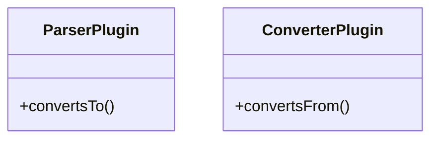
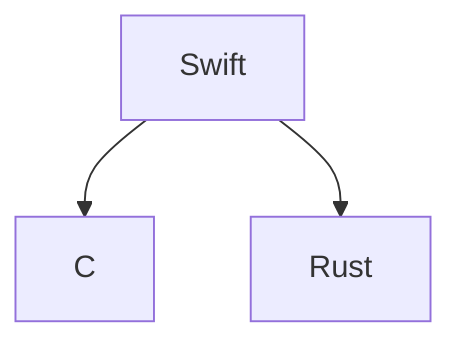
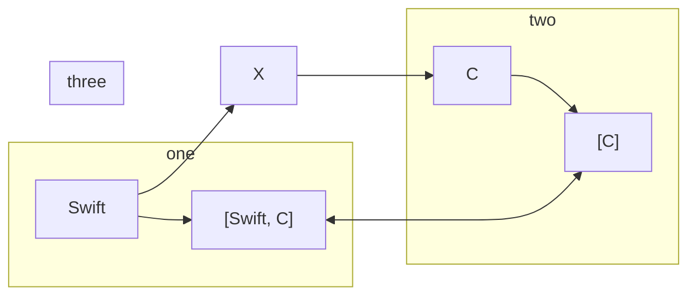
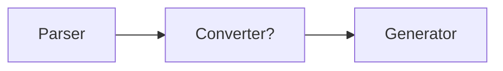

We want to convert Swift to C and Rust








Converter is part of parser

lib = Parser.parse()

Converter.convert(toLanguage:).write?

Generator.generate(lib).write()


```toml
[input]
language = "swift"
ffiLanguage = "c"
options....
ffiOptions....
```

