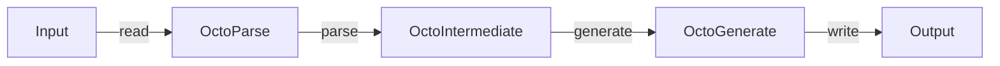

## Architecture

Input source file(s) get parsed by the `OctoParse` target. During this process, the input
is converted to an intermediate form given by the `OctoIntermediate` target. This
intermediate form can then be used to generate bindings for different languages.

## Adding a new input lanuage

`OctoParse` needs a way of converting input into the intermediate representation `OctoLibrary`.

## Adding a new output language

`OctoGenereate` needs a way of converting an `OctoLibrary` to code of the target language.
Everything is built up in memory and finally written out using a generic write(to: URL) method.
The `to` variable can be a directory or file, depending on the needs of the target language.
